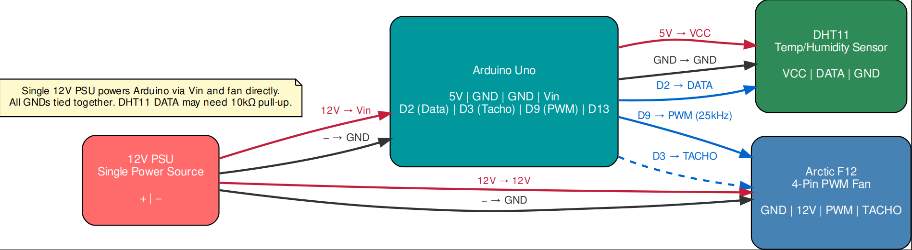
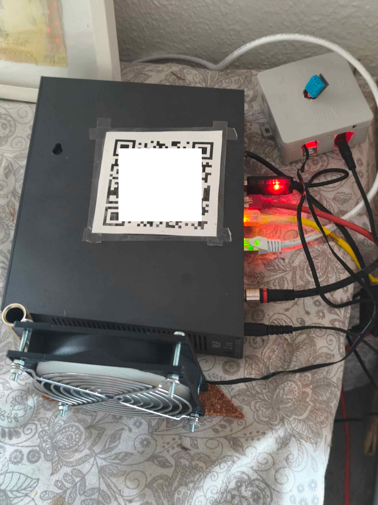

= Temperature Adaptive Fan
:toc: left
:toclevels: 2
:icons: font
:source-highlighter: rouge
:sectnums:

== Overview

This document describes the hardware wiring for the **Temperature Adaptive Fan** project, which uses an Arduino Uno to control an PWM Fan PWM fan based on temperature readings from a DHT11 sensor. A single 12V power supply powers both the Arduino (via the `Vin` pin) and the fan directly.

== Wiring Diagram

== Hardware Components

[cols="1,2,3", options="header"]
|===
| Component | Model | Purpose

| Microcontroller | Arduino Uno | Reads temperature, generates 25kHz PWM, controls fan speed
| Temperature Sensor | DHT11 (HS-11) | Measures ambient/router temperature
| Cooling Fan | PWM Fan 4-Pin PWM | 120mm PC fan with PWM speed control
| Power Supply | 12V DC PSU (≥1A) | Powers Arduino via Vin and fan motor directly
|===

== Pin Assignment Table

[cols="1,1,1,3", options="header"]
|===
| Source | Pin | Destination | Description

| 12V PSU | + | Arduino Vin | Powers Arduino via onboard voltage regulator (7-12V input)
| 12V PSU | + | Fan 12V | Powers fan motor directly
| 12V PSU | − | Arduino GND | Common ground reference
| 12V PSU | − | Fan GND | Shared ground with Arduino
| Arduino | 5V | DHT11 VCC | Powers temperature sensor
| Arduino | GND | DHT11 GND | Sensor ground
| Arduino | D2 | DHT11 DATA | One-wire temperature/humidity signal
| Arduino | D9 | Fan PWM | 25kHz PWM speed control (Timer1)
| Arduino | D3 | Fan TACHO | Optional RPM feedback (2 pulses per revolution)
|===

== Important Notes

.Single Power Supply
====
The 12V PSU powers **both** the Arduino (via the `Vin` pin) and the PWM Fan fan motor directly. The Arduino's onboard voltage regulator steps the 12V down to 5V for the microcontroller and the `5V` output pin. All ground connections must be tied together to ensure a common reference voltage.
====

.DHT11 Pull-up Resistor
====
If your DHT11 module does not have a built-in pull-up resistor, place a **10kΩ resistor** between the `DATA` and `VCC` pins. Most pre-assembled DHT11 modules (with the blue PCB) already include this resistor.
====

.Pin 9 is Fixed for 25kHz PWM
====
The code uses `Timer1` on **Pin 9** to generate the 25kHz PWM signal required by standard 4-pin PC fans. Do not move the PWM wire to another pin without modifying the timer registers in the sketch.
====

.Tachometer is Optional
====
The `D3` → `TACHO` connection is optional. The `readRPM()` function in the Arduino sketch is commented out by default. If enabled, the fan sends 2 pulses per revolution; multiply the counted pulses by 30 to get RPM.
====

== Configuration

The Arduino sketch uses the following constants (defined in the source code):

[source,c]
----
#define DHTPIN    2    // Temperature sensor data pin
#define PWM_PIN   9    // Timer1 25kHz PWM output
#define TACHO_PIN 3    // Optional RPM readout

const float TEMP_START     = 22.0;  // Fan starts spinning (rising temp)
const float TEMP_HALF      = 24.0;  // 50% fan speed
const float TEMP_MAX       = 35.0;  // 95% fan speed
const float TEMP_EMERGENCY = 50.0;  // 100% alarm / emergency
----

== Power Budget Estimate

[cols="1,1,1", options="header"]
|===
| Component | Voltage | Current (typical)

| Arduino Uno (idle) | 5V (regulated) | ~50 mA
| DHT11 Sensor | 5V | ~0.5 mA (standby) / ~2.5 mA (active)
| PWM Fan (max) | 12V | ~150 mA
|===

A **12V 1A (12W) power supply** provides ample headroom for this setup.

I used a 5V to 12V USB step-up converter to power the Arduino from a USB port.
